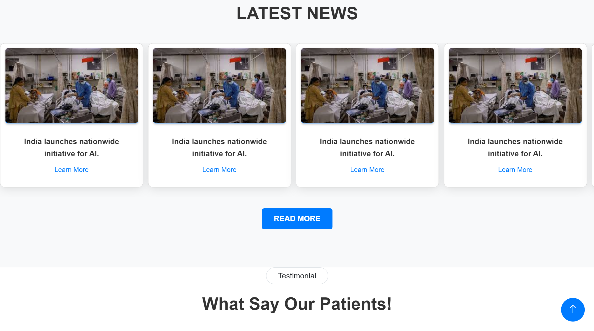

# 🌟 Hospital Management System 🌟

## SIH - Hospital


### SIH 2024 Smart Care Ninjas PPT


## 🚀 Getting Started

To get a local copy of this project up and running, follow these steps:

1. **Clone the repository:**
   ```bash
   git clone https://github.com/ManaS066/sih-hospital_.git
   ```

2. **Navigate to the project directory:**
   ```bash
   cd sih-hospital_
   ```

3. **Install the required dependencies:**
   ```bash
   pip install -r requirements.txt
   ```

4. **Run the back-end server:**
   ```bash
   python app.py
   ```

5. **Open your browser and visit:**
   ```
   http://localhost:5000
   ```

<hr>

<div align="center">

### 💻 **Tech Stacks**


</div>

<hr>

## ✨ Features

- **User Registration & Login**: Secure user authentication for patients and admin roles.
- **Dashboards**: Comprehensive dashboards for users, doctors, and admins to manage operations effectively.
- **Patient Management**: Add, view, and manage patient records with ease.
- **Appointment Scheduling**: Patients can book and manage their appointments.
- **Real-Time Bed Availability**: Monitor and manage bed occupancy dynamically.
- **Inventory Management**: Keep track of medicines and supplies efficiently.
- **Feedback System**: Collect and manage patient feedback to improve services.

## 🌈 Project Overview

This Hospital Management System is designed to optimize queuing models and resource availability to enhance patient care. It integrates seamlessly with city-wide healthcare modules for real-time data sharing. The system addresses critical challenges in patient flow, bed availability, and resource management, ultimately improving healthcare delivery and patient experiences.

##  Contribution

Contributions are what make the open-source community such an amazing place to learn, inspire, and create. Any contributions you make are **greatly appreciated**.

- If you have any suggestions for the project, such as reporting a bug, improving the UI, or enhancing the README.md file, feel free to **open an issue** to discuss it or directly create a pull request with the necessary changes.
- Please make sure to check your spelling and grammar.
- Create individual pull requests for each suggestion to keep changes focused and manageable.

Your involvement helps to improve the project and make it better for everyone. Thank you for your contributions!

Kindly go through [CONTRIBUTING.md](CONTRIBUTING.md) to understand everything from setup to contributing guidelines.

If you would like to contribute to the project, please follow our contribution guidelines.


<!-- Code of conduct -->

## <h2> Code of Conduct</h2>

We are committed to fostering a welcoming and inclusive environment for everyone. All contributors and participants are expected to uphold the following values:

- Be respectful of different viewpoints and experiences.
- Show empathy toward others.
- Use inclusive language.

Please read and follow our [Code of Conduct](Code_of_Conduct.md) to foster an inclusive community.
If anyone violates these standards, they may be banned from the community.

<hr>

⭐️ Support Our Project
If you find this project helpful, please consider giving it a star on GitHub! Your support helps to grow the project and reach more contributors.

<hr>

## 📜 License

This project is licensed under the MIT License - see the [LICENSE](LICENSE) file for details.

## 🔄 Current Status and Future Needs

The project is currently under development, and contributions are welcome to enhance its functionality. Future updates will focus on improving user interfaces, adding more features, and integrating with additional healthcare systems.

## Required Webpages

### 🏥 Landing Page
A welcoming and informative homepage that provides an overview of the hospital's services, mission, and values. It features quick links to essential functions like user registration, login, and services offered.

### 📝 User Registration
A dedicated page for new users to create an account, capturing essential personal details such as name, email, phone number, and password. This page includes form validation to ensure accurate data entry and a secure registration process.

### 🔐 User Login
A secure login page for users to access their accounts by entering their registered email and password. The page also provides options for password recovery and assistance in case of login issues.

### 📊 User Dashboard
A personalized dashboard for users to view and manage their profiles, appointments, and feedback. It offers insights into upcoming appointments, notifications, and access to relevant health resources.

### 🦸‍♂️ Super Admin
A dedicated interface for super admins to oversee the entire hospital management system. This page includes advanced management features, analytics, and controls to ensure smooth operations across the platform.

### 🔒 Super Admin Login
A secure login page specifically for super admins, requiring high-level credentials to access sensitive administrative features and controls.

### 📋 Admin Dashboard
An admin dashboard providing an overview of hospital operations, including patient statistics, bed occupancy, and inventory management. Admins can also manage user roles and permissions from this page.

### 🔑 Admin Login
A secure login page for hospital administrators to access the admin dashboard and manage hospital operations effectively.

### 👩‍⚕️ Add Patient
A form page for admins and doctors to input new patient information, including personal details, medical history, and contact information. This page ensures that patient records are accurately captured and stored.

### 👨‍⚕️ Add Doctor
A dedicated page for adding new doctor profiles, including their qualifications, specialties, and availability. This page helps maintain an up-to-date roster of healthcare professionals within the hospital.

### 💊 Inventory (Medicine)
A comprehensive inventory management page that tracks medicines and supplies, allowing users to view current stock levels, expiration dates, and reorder supplies when necessary.

### 🩺 Doctor Dashboard
A personalized dashboard for doctors to manage their appointments, view patient records, and access relevant medical information. It facilitates streamlined workflows and enhances patient care.

### 💬 Feedback
A page where patients can submit their feedback on services received, allowing the hospital to gather insights and improve its offerings based on patient experiences.

### 🛏️ Bed Availability
A real-time overview of bed availability in different wards, helping hospital staff manage admissions and discharges effectively. This page assists in ensuring optimal utilization of hospital resources.

### 🗓️ OPD Availability
A dedicated page for managing and displaying the availability of outpatient department (OPD) services, allowing patients to check and book appointments based on real-time availability.

### Additional Pages

16. 📝 **Patient Registration**: A dedicated page for registering new patients, capturing their personal and medical information.
17. 🏥 **Hospital Services Overview**: A page outlining the various services offered by the hospital, including OPD services, specialized treatments, and emergency care.
18. 📅 **Appointment Scheduling**: A page for patients to book, view, and manage their appointments with doctors or other hospital services.
19. 📂 **Patient Records**: A page for accessing and managing patient medical records, including medical history, test results, and treatment plans.
20. 📝 **Patient Discharge Summary**: A page to generate and manage patient discharge summaries and ensure all necessary paperwork is completed.
21. 📊 **Reports & Analytics**: A dashboard for generating various reports related to hospital operations, patient statistics, bed occupancy, and resource utilization.
22. ⚕️ **Doctor Profiles**: A page that lists all doctors, including their specialties, experience, availability, and contact information.
23. 🛏️ **Real-Time Bed Availability Status**: A dynamic page showing real-time bed availability in various hospital wards.
24. 🏥 **Emergency Services**: A dedicated page for managing emergency services, including ambulance availability, ER status, and critical care units.
25. 📝 **Health Information and Tips**: A page providing educational content on health and wellness, prevention tips, and common medical conditions.
26. 📦 **Supplies & Equipment Inventory**: A page to manage inventory details of medical supplies and equipment, track usage, and initiate restocking.
27. 📲 **Notification and Alerts**: A system for sending notifications to staff and patients regarding appointment reminders, bed availability, emergency alerts, etc.
28. 💻 **Telemedicine Portal**: A page to facilitate virtual consultations between doctors and patients, especially useful for follow-ups or non-critical care.
29. 📞 **Contact Us**: A page providing contact information for different hospital departments, including phone numbers, email addresses, and a contact form.
30. 🔄 **System Administration**: A page for managing system settings, user roles, and permissions within the hospital management software.
31. 📚 **Training and Resources**: A page dedicated to staff training materials, user manuals, and other resources to help hospital staff navigate and use the system efficiently.
32. 📝 **Patient Feedback and Grievance**: A form for patients to provide feedback on their experience and raise any concerns or grievances.

## Problem Statement Title

### Optimizing Queuing Models and Resource Availability in Hospitals for Enhanced Patient Care 🏥

### Description

In the current healthcare environment, managing patient flow and resource allocation is critical, especially in Outpatient Departments (OPDs) and during patient admissions. Hospitals often face challenges in efficiently queuing patients, managing bed availability, and processing admissions, leading to increased waiting times, patient dissatisfaction, and potential risks to patient health. 😷

This problem statement focuses on developing a hospital-based solution that can optimize queuing models in OPDs, manage bed availability, and streamline the admission process. The solution should be designed to integrate seamlessly with a city-wide healthcare module, allowing for real-time data sharing and coordination across multiple healthcare facilities. 🌍

### Key Objectives

- **Queuing Optimization**: 🕒 Develop algorithms to reduce patient waiting times in OPDs by predicting patient flow and adjusting queuing models dynamically.
- **Bed Availability Management**: 🛏️ Create a system to monitor and forecast bed occupancy, ensuring efficient allocation of available beds and timely admissions.
- **Admission Process Streamlining**: 📑 Automate the admission process to reduce paperwork, minimize errors, and expedite patient onboarding.

The solution should leverage data analytics, machine learning, and real-time communication technologies to enhance the overall efficiency of hospital operations, improve patient experiences, and ensure better utilization of healthcare resources. 💡

Integration with a city-wide module will enable hospitals to coordinate care, share critical resource information, and respond more effectively to surges in patient demand, particularly during emergencies or pandemics. 🚑

### Technological Solution for Hospital Operations and Inventory Management

#### Overview

To address the complexities of managing patient flow and resources within hospitals, a comprehensive technological solution is essential. This solution should focus on several key areas:

- **Queuing Models in OPDs**: 🕒
  - **Objective**: Optimize patient queuing in Outpatient Departments (OPDs) to minimize wait times and improve service efficiency.
  - **Technology**: Develop algorithms and real-time scheduling systems to predict patient arrivals, manage appointment slots, and dynamically adjust queuing models based on real-time data.

- **Bed Availability and Patient Admissions**: 🛏️
  - **Objective**: Efficiently manage bed availability and streamline the patient admission process to enhance hospital operational efficiency.
  - **Technology**: Implement systems for

 real-time monitoring of bed occupancy, predictive analytics for forecasting bed availability, and automated admission processes to reduce manual interventions and errors.

- **Medicine and Consumable Dispensation**: 💊
  - **Objective**: Improve the management of medicine and consumable inventory, ensuring timely availability and reducing waste.
  - **Technology**: Develop modules for tracking medicine and consumable dispensation, integrating with electronic health records (EHR) to monitor usage patterns, and automate reordering processes based on inventory levels.

- **Inventory Management Modules**: 📦
  - **Objective**: Streamline hospital inventory management to ensure optimal stock levels and efficient resource utilization.
  - **Technology**: Implement inventory management systems that integrate with hospital procurement and supply chain processes, providing real-time insights into stock levels, expiration dates, and consumption trends.

- **Integration with City-Wide Module**: 🌐
  - **Objective**: Ensure seamless integration with city-wide healthcare modules to enable coordinated care and resource sharing among multiple healthcare facilities.
  - **Technology**: Develop interfaces and data exchange protocols that facilitate integration with existing city-wide systems, enabling real-time communication and data sharing for enhanced patient care and resource management.

### Current Status and Future Needs

The National Informatics Centre (NIC) has developed some modules addressing these areas, but their implementation in Delhi has not yet commenced. A hospital-based solution that integrates these modules with city-wide systems is crucial to achieving comprehensive improvements in hospital operations and resource management. 🏙️

### Conclusion

A robust technological solution that addresses queuing models, bed availability, admission processes, and inventory management will significantly enhance hospital efficiency and patient care. Integration with city-wide modules will further ensure that hospitals can effectively coordinate with other healthcare providers, improving overall healthcare delivery. 🤝

## 🔧 Technology Stack

### Front-End:
- **HTML** 🌐: For structuring and presenting content on webpages.
- **CSS** 🎨: For styling and designing the user interface, ensuring it is visually appealing and user-friendly.
- **JavaScript** ⚙️: For adding interactivity and dynamic elements to webpages, such as form validations and real-time updates.

### Back-End:
- **Python** 🐍: The primary programming language for server-side logic and handling data operations.
- **Flask** 🌶️: A lightweight web framework for Python to build back-end logic, handle routing, and manage APIs.

### Database:
- **MongoDB Atlas** 🍃: A cloud-based NoSQL database for storing and managing patient records, doctor profiles, bed availability, inventory details, and other critical data.

### Integration:
- **APIs** 🌐: For integrating with other city-wide healthcare modules and enabling real-time data sharing and communication.
- **WebSockets** 📡: To facilitate real-time updates for bed availability, OPD schedules, and notifications.

### Data Analytics:
- **Python Libraries** 📈 (e.g., Pandas, NumPy): For analyzing data related to hospital operations, patient flow, and resource utilization.

### Security:
- **SSL/TLS Encryption** 🔐: To ensure secure communication between the client and server.
- **Authentication and Authorization** 🔑: To manage user access and protect sensitive patient and hospital data.


## <h2>🔗 Contact Us</h2>

<table>
    <tr>
        <th>Role</th>
        <th>LinkedIn</th>
        <th>GitHub</th>
        <th>Email</th>
    </tr>
    <tr>
        <td>Project Admin</td>
        <td><a href="https://www.linkedin.com/in/abhisekpanda2004/" target="_blank">LinkedIn</a></td>
        <td><a href="https://github.com/abhisek2004" target="_blank">GitHub</a></td>
        <td>abhisek2004panda@gmail.com</td>
    </tr>
    <tr>
        <td>Mentor</td>
        <td><a href="https://www.linkedin.com/in/manas-ranjan-pradhan/" target="_blank">LinkedIn</a></td>
        <td><a href="https://github.com/ManaS066" target="_blank">GitHub</a></td>
        <td>manasranjanpradhan2004@gmail.com</td>
    </tr>
    <tr>
        <td>Mentor</td>
        <td><a href="https://www.linkedin.com/in/debabrata-mishra-148121289/" target="_blank">LinkedIn</a></td>
        <td><a href="https://github.com/debaraja-394" target="_blank">GitHub</a></td>
        <td>debabrat827@gmail.com</td>
    </tr>
<!--      <tr>
        <td>Mentor</td>
        <td><a href=" # " target="_blank">LinkedIn</a></td>
        <td><a href=" # " target="_blank">GitHub</a></td>
        <td> @gmail.com</td>
    </tr>
    <tr>
        <td>Mentor</td>
        <td><a href=" # " target="_blank">LinkedIn</a></td>
        <td><a href=" # " target="_blank">GitHub</a></td>
        <td> @gmail.com</td>
    </tr> -->
</table>

<hr>

### 📸 Website Preview





🌐 **Visit our website:** [sih-hospital_](#)


##  <h2 align = "center">Our Contributors</h2>
 <h3>Thank you for contributing to our repository</h3>


## Stargazers

<div align='center'>

[](https://github.com/ManaS066/sih-hospital_/stargazers)

</div>

## Forkers

<div align='center'>

[](https://github.com/ManaS066/sih-hospital_/network/members)

</div>


<div align="center">
    <a href="#top">
        
    </a>
</div>

### Show some ❤️ by starring this awesome repository!
